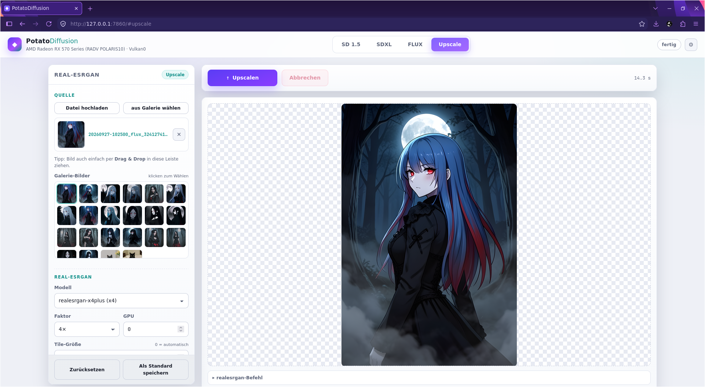
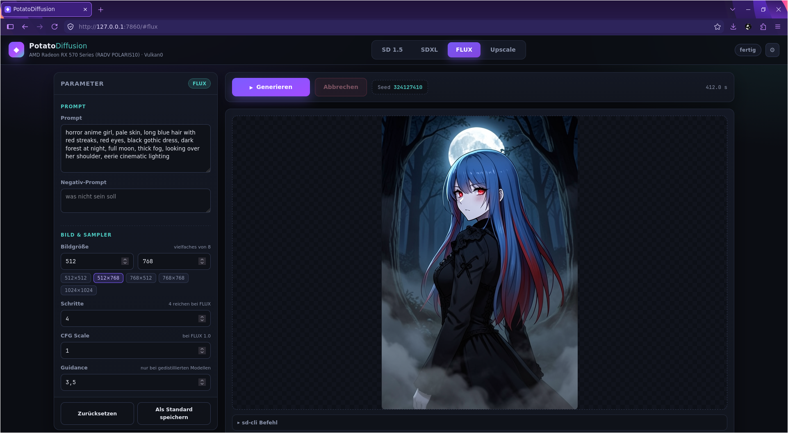

# PotatoDiffusion WebUI

A lightweight web interface for **stable-diffusion.cpp (`sd-cli`)** with a **Vulkan-only inference pipeline**, designed specifically for low-end GPUs.

The goal is simple:

> **Run modern AI image generation on hardware that normally gets ignored.**

No PyTorch.
No CUDA/ROCm.
No huge Python ML stack.

Just **Vulkan, a GPU, and the models you want to run.**

Tested on an **AMD Radeon RX 570 with 4 GB VRAM**.

---

## Demo

### FLUX Workflow

[](media/flux2_workflow.mp4)

*Click to watch the full FLUX workflow: prompt, generation and upscaling.*

### Interface

| Light Mode | Dark Mode |
|------------|-----------|
|  |  |

---

## Features

### AI Image Generation

The WebUI provides dedicated interfaces for:

* **Stable Diffusion 1.5**
* **Stable Diffusion XL**
* **FLUX**
* **Real-ESRGAN Upscaling**

Each model family has its own paths and parameter defaults.

Everything can be configured through the WebUI, including model paths, resolution, sampling parameters, backend settings, VRAM limits and additional `sd-cli` arguments.

### Built for Low-End Hardware

The default configurations are designed around the idea that **AI image generation does not require a high-end GPU**.

Low-end friendly defaults include:

* SD 1.5 at 512×512
* SDXL at 768×768
* FLUX at 512×512
* VAE tiling
* CPU text encoding where appropriate
* CPU offloading
* quantized GGUF models
* configurable VRAM limits
* configurable tile sizes for Real-ESRGAN

The project was tested on a **4 GB RX 570**, including FLUX workflows with CPU text encoding.

---

## Generate → Upscale

Generation and upscaling can be used as a single workflow.

After generating an image, Real-ESRGAN can automatically be executed as a post-processing step:

```text
Prompt
  ↓
sd-cli / Vulkan
  ↓
Generated image
  ↓
Real-ESRGAN / Vulkan
  ↓
Upscaled image
```

Alternatively, Real-ESRGAN can be used completely standalone.

You can:

* upload an image
* select an image from the gallery
* choose the Real-ESRGAN model
* select the scale factor
* configure tile size
* select the GPU
* run the upscale independently of image generation

The generated and upscaled images are kept in separate locations and have their own metadata/history.

---

## Interface

The UI supports:

* 🌙 Dark mode
* ☀️ Light mode
* 🖥️ System theme
* live generation progress
* live preview
* generation logs
* seed tracking
* image gallery
* metadata
* reproducible generations
* job cancellation
* automatic reconnection after page reload
* drag & drop uploads
* keyboard shortcuts

The exact `sd-cli` or Real-ESRGAN command is also shown before each job.

This makes it easy to see what the WebUI is actually doing instead of hiding everything behind a GUI.

---

## Installation

### Requirements

* Linux
* **Python 3.11+**
* Vulkan drivers
* A Vulkan-capable GPU
* `sd-cli`
* `realesrgan-ncnn-vulkan`

The bundled binaries are placed in `bin/`.

The WebUI itself has intentionally very few Python dependencies:

* Flask
* Pillow

No PyTorch installation is required.

### Clone the repository

```bash
git clone https://github.com/sheepfreak221/PotatoDiffusion
cd PotatoDiffusion
```

### Install the Python dependencies

```bash
python3 -m pip install -r requirements.txt
```

### Start the WebUI

```bash
./start.sh
```

The default address is:

```text
http://127.0.0.1:7860
```

---

## First Start

On the first start, `start.sh` performs a few checks:

- Creates the required directory structure if it doesn't exist yet
- Verifies that the required binaries are present and executable:
- If either binary is missing, the script exits with a message pointing to the official repositories:
  - sd-cli: https://github.com/leejet/stable-diffusion.cpp
  - realesrgan-ncnn-vulkan: https://github.com/xinntao/Real-ESRGAN-ncnn-vulkan

Make sure they are executable (chmod +x).

---

## Directory Structure

The project deliberately follows a structure similar to ComfyUI, with models and executables kept in predictable locations.

```text
sd-webui/
├── app.py
├── requirements.txt
├── config.json
├── start.sh
│
├── bin/
│   ├── sd-cli
│   └── realesrgan-ncnn-vulkan
│
├── models/
│   ├── checkpoints/
│   │   ├── SD1.5/
│   │   └── SDXL/
│   ├── diffusion-models/
│   │   └── FLUX/
│   ├── textencoder/
│   ├── vae/
│   └── upscale/
│
├── templates/
│   └── index.html
│
├── static/
│   ├── app.css
│   └── app.js
│
├── outputs/
│   └── generated images + metadata
│
└── upscale/
    ├── uploads/
    └── upscaled images + metadata
```

This means the WebUI can be kept as a self-contained directory with the executables, models and generated files all organized in one place.

---

## Configuration

Configuration is stored in:

```text
config.json
```

Paths can either be edited directly or configured through the settings dialog in the WebUI.

Typical configuration includes:

```json
{
  "sd_cli": "./bin/sd-cli",
  "output_dir": "./outputs",

  "listen": {
    "host": "127.0.0.1",
    "port": 7860
  },

  "upscale": {
    "binary": "./bin/realesrgan-ncnn-vulkan",
    "model_dir": "./models/upscale",
    "output_dir": "./upscale",
    "default_model": "realesrgan-x4plus"
  }
}
```

Model-specific paths and defaults are stored separately for SD 1.5, SDXL and FLUX.

The WebUI can also save parameter defaults directly from each model tab.

---

## Model Configuration

### SD 1.5

Configure:

* checkpoint
* CLIP
* resolution
* steps
* CFG
* sampler
* scheduler
* seed
* batch size
* Clip Skip
* optional Real-ESRGAN post-processing

### SDXL

Additional SDXL-specific settings include:

* CLIP-L
* CLIP-G
* VAE tiling
* resolution
* sampling parameters
* VRAM-related options

### FLUX

FLUX supports the corresponding `stable-diffusion.cpp` components:

* diffusion model
* LLM / text encoder
* VAE
* VAE format
* optional CLIP components
* VAE tiling
* guidance
* sampling parameters

The generated command is shown directly in the UI, for example:

```bash
sd-cli \
  --diffusion-model flux-2-klein-4b-Q4_K_M.gguf \
  --llm Qwen3-4B-Q4_K_M.gguf \
  --vae ae.safetensors \
  --vae-format flux2 \
  --backend diffusion=vulkan0,te=cpu,vae=vulkan0 \
  --vae-tiling \
  -W 512 -H 512 \
  --steps 4 \
  --cfg-scale 1 \
  --guidance 3.5 \
  --sampling-method euler
```

Additional backend, VRAM, weight-type, threading and arbitrary `sd-cli` options can be configured through the **Advanced** section.

---

## Real-ESRGAN

Real-ESRGAN is integrated through:

```text
realesrgan-ncnn-vulkan
```

Models are automatically detected from:

```text
models/upscale/
```

The WebUI supports:

* multiple Real-ESRGAN models
* x2 / x3 / x4 scaling where supported
* automatic tile sizing
* manual tile sizing
* GPU selection
* standalone upscaling
* automatic post-generation upscaling

A typical command looks like:

```bash
bin/realesrgan-ncnn-vulkan \
  -i input.png \
  -o output.png \
  -n realesrgan-x4plus \
  -m models/upscale \
  -s 4 \
  -g 0
```

---

## Low-End GPU Tips

The project was specifically developed with hardware such as a **4 GB RX 570** in mind.

For very limited VRAM:

### Quantize your models

This is the single most important step for low-end hardware. Quantized models use significantly less memory and run faster, often at a small quality cost.

You can quantize a model directly with `stable-diffusion.cpp`:

```bash
./bin/sd-cli \
  -M convert \
  -m /path/to/model.safetensors \
  -o /path/to/model-q4_0.gguf \
  --type q4_0
```

Replace `/path/to/model.safetensors` with your downloaded model and `/path/to/model-q4_0.gguf` with the desired output path. The `--type q4_0` flag sets the quantization level. For very low VRAM, `q4_0` is a good starting point; for slightly better quality, `q4_K_M` is also common.

The resulting `.gguf` file can then be selected as the model in the WebUI.

### Use CPU text encoding

For example:

```text
diffusion=vulkan0
te=cpu
vae=vulkan0
```

This reduces VRAM usage at the cost of additional CPU processing time.

### Enable VAE tiling

Especially useful for SDXL and FLUX.

### Use CPU offloading

Depending on the model and available VRAM, options such as:

```text
--offload-to-cpu
```

or:

```text
--max-vram3.5
```

can help prevent out-of-memory errors.

### Keep resolutions realistic

Suggested starting points for a 4 GB GPU:

| Model  | Starting resolution |
| ------ | ------------------: |
| SD 1.5 |             512×512 |
| SDXL   |             768×768 |
| FLUX   |             512×512 |

Quantized GGUF models are also strongly recommended for low-end hardware.

---

## Vulkan

This project intentionally uses a Vulkan-based inference stack.

The idea is to avoid tying low-end AI workloads to a specific GPU vendor or heavyweight ML framework.

The WebUI itself does not perform neural-network inference.

Instead, it orchestrates:

```text
WebUI
  │
  ├── sd-cli
  │     └── Vulkan
  │
  └── realesrgan-ncnn-vulkan
        └── Vulkan
```

This keeps the UI lightweight and lets the underlying Vulkan applications handle the actual GPU work.

---

## API

The WebUI also exposes a small HTTP API.

| Endpoint              | Method   | Purpose                   |
| --------------------- | -------- | ------------------------- |
| `/`                   | GET      | WebUI                     |
| `/api/config`         | GET/POST | Read/write configuration  |
| `/api/generate`       | POST     | Start generation          |
| `/api/stream`         | GET      | SSE job stream            |
| `/api/cancel`         | POST     | Cancel a job              |
| `/api/status`         | GET      | Current job status        |
| `/api/gallery`        | GET      | Gallery images + metadata |
| `/api/delete`         | POST     | Delete an image           |
| `/api/upscale/models` | GET      | List Real-ESRGAN models   |
| `/api/upscale/upload` | POST     | Upload an image           |
| `/api/upscale`        | POST     | Start an upscale job      |
| `/api/upscale/list`   | GET      | Upscale history           |
| `/api/upscale/delete` | POST     | Delete an upscale result  |
| `/api/devices`        | GET      | List Vulkan devices       |

Generation progress is streamed through Server-Sent Events, including logs, steps, seeds, previews and completion status.

---

## Network Access

By default the WebUI listens only on:

```text
127.0.0.1
```

To make it accessible from other machines, change:

```json
"listen": {
  "host": "0.0.0.0",
  "port": 7860
}
```

**There is no built-in authentication.**

Do not expose the WebUI directly to an untrusted network without putting appropriate access controls in front of it.

---

## Keyboard Shortcuts

| Shortcut       | Action             |
| -------------- | ------------------ |
| `Ctrl + Enter` | Generate / Upscale |
| `Esc`          | Close dialog       |

Deep links are also available:

```text
/#sd15
/#sdxl
/#flux
/#upscale
```

---

## Why?

Most AI image generation software assumes relatively modern hardware and usually comes with a substantial software stack.

This project takes a different approach:

**What if we simply made the interface lightweight and let Vulkan do the heavy lifting?**

The result is a small, self-contained WebUI that can sit on top of Vulkan-native command-line tools and make them accessible without requiring a complete Python ML environment.

The target is not a datacenter GPU.

The target is the hardware sitting in the drawer that everyone else already declared obsolete. 🥔

---

## Project Status

This is an experimental project.

The WebUI is primarily designed around the workflows and hardware it was developed and tested with. Other GPUs, drivers, models and Vulkan implementations may behave differently.

If something does not work:

1. Try the underlying `sd-cli` command directly.
2. Check the Vulkan driver/device.
3. Check the generated command shown by the WebUI.
4. Check the application log.

The WebUI is intentionally transparent about the commands it executes.

---

## License

See the repository license for details.

The WebUI itself is separate from the underlying projects and models it can launch. Check the respective licenses of:

* stable-diffusion.cpp
* Real-ESRGAN / realesrgan-ncnn-vulkan
* downloaded models
* Vulkan drivers

---

## Philosophy

**No CUDA/ROCm.
No PyTorch.
No cloud.
No expensive GPU required.**

Just Vulkan and whatever hardware you have.

If a 4 GB GPU can still generate images in 2026, maybe it wasn't obsolete after all.

## Hardware Requirements

- PotatoDiffusion requires a Vulkan-capable GPU with dedicated VRAM.

- Supported: Old AMD GPUs (RX 400/500 series, Vega), old Nvidia GPUs (GTX 900/1000 series), AMD APUs (Ryzen 2000/3000/5000 series with Vega iGPU).

- Not supported: Intel iGPUs (Vulkan compute is not reliable enough), very old GPUs without Vulkan support.

- Tested on: AMD Radeon RX 570 (4 GB VRAM).